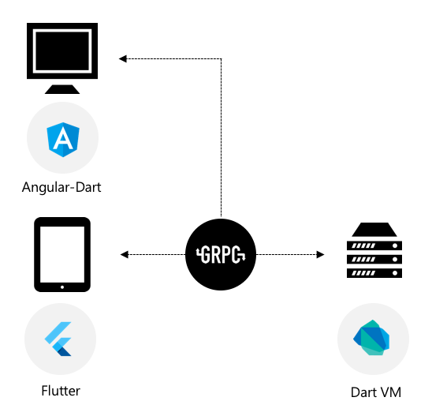

# Fullstack with Dart

An example that uses Dart language for developing all the application layers. This experiments purpose is also to find an approach to share a maximum of logic by applying interresting architectural patterns.



## Server (api)

### GRPC Specifications

The server is fully based on [GRPC](https://grpc.io/) and [Protocol Buffers](https://developers.google.com/protocol-buffers/). Basicaly, this technology allows you to specify your Services (and its messages) format through a dedicated language ([proto3](https://developers.google.com/protocol-buffers/docs/proto3)).

The [api](./api) project contains the type and service specifications. A set of Dart classes are generated into the [generated](./api/generated) folder by executing the following command (make sure you installed [protoc]() and the dart plugin):

```bash
> cd api/api_messages
> protoc --dart_out=grpc:generated --proto_path=<project-root>/api/api_messages/lib   -Iprotos tasks.proto
```

This will generate a [TaskServiceClient](./api/lib/generated/generated.tasks.pbgrpc.dart) that will be used from the client side and a [TaskServiceBase](./api/lib/generated/generated.tasks.pbgrpc.dart) that is the abstract class in which the server must implement the actual logic.

### Service implementation

[A basic service implementation](./server/lib/services/tasks.dart) that keeps history in memory is provided.

### Running

To start the server, execute the following command:

```bash
> dart server/bin/server.dart
```

## Client (mobile, web)

### Shared

All the application state is shared through a reactive architecture based on `Stream`, `StreamBuilder`, `InheritedWidget` and reactive extensions.

To learn more, watch [Build reactive mobile apps with Flutter (Google I/O '18)](https://www.youtube.com/watch?v=RS36gBEp8OI).

Basically, all the application logic is stored in a [TaskBloc]() that exposes various input and output streams.

### Mobile *(Flutter)*

The mobile is composed of [several widgets](./app/app_mobile/lib/widgets) which subscribe to the global [TaskBloc]() container widget.

### Web *(Angular-Dart)*

*WIP*